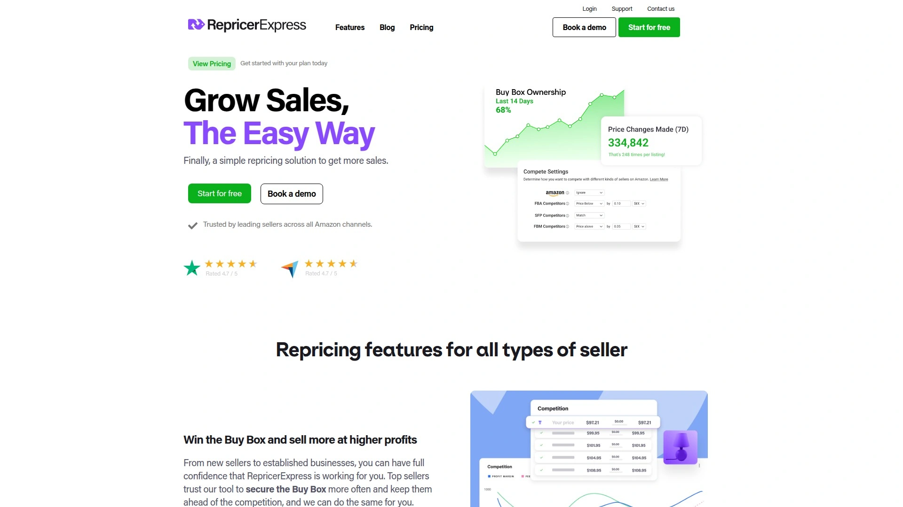

# 2025年十二大最佳Amazon自动调价工具

电商卖家在亚马逊和沃尔玛平台上面临的最大挑战之一就是价格竞争——如果手动调整价格,不仅耗时费力,还容易错失Buy Box(购买按钮)获取机会。自动调价工具通过AI算法和实时市场数据分析,帮助卖家在保持利润率的同时自动优化产品定价,平均可提升63%的Buy Box获胜率并增加145%的销售额。本文精选了12款2025年最具竞争力的Amazon和Walmart自动调价软件,涵盖AI驱动策略、游戏理论算法、多渠道支持等核心功能,助您在激烈的电商市场中保持价格优势并实现利润最大化。

## **[Aura](https://goaura.com)**

新一代AI驱动的亚马逊和沃尔玛自动调价平台,10分钟内完成设置即可启动盈利增长。

Aura将自己定位为"Amazon调价副驾驶",通过先进的AI技术为每个商品实时自动确定最佳策略,让卖家无需微观管理价格即可专注于业务的更广泛层面。平台的智能化方法在保护利润率的同时确保您在快节奏的亚马逊世界中保持竞争力,AI能力快速适应市场变化并严格遵守您设置的最低和最高价格边界。

核心功能包括AI最优策略实时决策、自动化工作流创建、完整的价格活动日志(记录每次价格更新的详情和原因)、批量上传(通过Excel或Sheets更新商品)以及自动最小/最大价格计算(基于ROI、利润率、固定利润和利润底线)。集成InventoryLab等工具自动导入成本数据,确保定价决策基于准确的成本信息。报告导出功能提供关键数据帮助做出更明智的决策。

客户支持团队位于美国波士顿,绝不外包,提供周一至周五上午9点至下午5点(东部时间)的实时聊天服务。全球专业用户社区提供24/7全天候互助支持。用户反馈显示使用Aura后立即看到效果,AI策略简单易用且智能,界面简洁具有"苹果风格"的高端设计感。真实案例显示卖家使用Aura后三天内销售额提升200%,年销售额从5000美元增长至157000美元,ROI从20%提升至40%以上。提供14天免费试用,无需信用卡即可开始使用。

## **[BQool](https://www.bqool.com)**

下一代AI驱动的亚马逊调价器,采用自主机器学习技术持续赢得Buy Box。

BQool的AI模型基于从亚马逊市场收集的数十亿数据点构建,综合考虑Buy Box状态、价格、配送属性、卖家评级、卖家报价等众多因素,为每位用户量身定制最佳调价AI模型。平台提供三种核心AI策略:激进模式抢占Buy Box并最小化竞争对手捕获机会、渐进模式以增量方式调价以赢得Buy Box同时最大化利润、匹配并提升模式首先匹配Buy Box价格然后提高价格以捕获更大利润。

AI模型经历数据收集、信息输入、模型训练、价格预测和结果捕获的完整循环,确保能够学习特定ASIN的竞争环境并准确预测未来价格走势,从而实现更高的销售额和利润。定价极具竞争力,AI计划从每月25美元起,提供14天免费试用且无需信用卡。平台针对2025年8月31日前注册的新用户提供限时优惠代码,适用于50美元及以上套餐。支持亚马逊全球所有市场,适合各种规模的卖家从小型到大型企业。

## **[Repricer.com](https://www.repricer.com)**

最快速的多渠道自动调价平台,支持亚马逊、eBay、沃尔玛和Shopify无缝管理。

Repricer.com是24/7全天候运行的自动调价工具,通过监控竞争对手定价并基于卖家评级、库存水平、位置等多种参数做出智能决策,帮助您赢得Buy Box并增加销售。平台的独特之处在于能够"跳出框架思考",建议在策略中进行微调以实现更多销售。可以针对特定卖家或某些产品进行更激烈的竞争,价格变更在数秒内完成确保您始终保持竞争力。

支持所有21个亚马逊市场以及eBay、沃尔玛、Shopify等多个销售渠道,允许您在每个销售平台上复制价格或为每个渠道设置定制规则以提升利润。设置最低价格确保始终以盈利方式销售,可根据库存水平更改价格。提供最大化Buy Box曝光的功能,帮助您获得更多销售机会。定价从每月179美元起,提供14天免费试用且无需信用卡。多渠道一致性定价和定制化规则使其特别适合在多个平台销售的卖家。

## **[Informed Repricer](https://www.informed.co)**

算法驱动的调价工具,帮助亚马逊和沃尔玛卖家在两周内将Buy Box拥有率提升63%。

Informed Repricer采用"获取Buy Box"算法快速根据竞争情况调整价格,利用历史销售数据计算最优价格点。平台的利润保护功能在增加销售的同时最大化利润,允许卖家输入产品成本确保每次销售都能盈利。销售速度算法在没有竞争时自动提高价格,充分捕获市场愿意支付的溢价。

智能价格重置和智能最大价格设置功能旨在防止价格停用,同时优化定价策略。平台提供多种策略供私标卖家使用,包括最优价格和Pricely等高级选项。分析和报告功能跟踪关键指标,帮助卖家做出数据驱动的决策。无限SKU支持和所有层级的完整功能使其适合任何规模的卖家。

定价基于月收入分为三个层级:Foundation计划99美元/月、Expansion计划147美元/月、Enterprise计划249美元/月,提供14天免费试用。支持亚马逊美国、加拿大、英国、墨西哥、巴西、德国、法国、意大利、西班牙、荷兰、日本、澳大利亚、阿联酋、瑞典、波兰、比利时、南非、土耳其、沙特阿拉伯、新加坡以及沃尔玛市场。用户反馈显示易于使用、显著提升Buy Box获胜率、提供出色的分析功能。

## **[Seller Snap](https://sellersnap.io)**

基于游戏理论的AI调价器,采用合作策略避免价格战并最大化利润率。

Seller Snap的软件设计理念是避免价格战,从游戏理论中学习并采用"合作策略"。传统基于规则的调价器会导致卖家短期内只考虑自己最优而忽略亚马逊销售涉及多个价格变化周期的事实,最终引发价格竞相降低。Seller Snap的AI会自动为每种特定情况应用最佳策略,目标是获得您"应得"的Buy Box份额同时保持高价格,而不是竞相压价。

平台支持巴西、加拿大、墨西哥、美国、阿联酋、德国、埃及、西班牙、法国、英国、意大利、荷兰、波兰、沙特阿拉伯、瑞典、土耳其、新加坡和澳大利亚共18个亚马逊市场。与沃尔玛的集成允许卖家即时轻松地将产品价格从亚马逊同步到沃尔玛。支持FTP文件传输和欧洲履行网络(EFN)偏好设置以优化最小/最大价格计算器和利润计算。

您只需导入最低和最高价格即可开始调价,成本是可选的但推荐导入以充分利用Seller Snap的分析功能。用户反馈显示该调价器倾向于将价格向上拉升远超其他调价器,特别适合已有一定销售规模的亚马逊业务。虽然不是最经济实惠的调价器,但其质量与价格点相匹配。提供15天免费试用。

## **[RepricerExpress](https://www.repricerexpress.com)**

适用于亚马逊和eBay卖家的强大调价解决方案,提供24/7自动调价和可定制策略。

RepricerExpress通过保持竞争性且盈利的价格帮助卖家赢得Buy Box并增加销售。平台提供24/7全天候自动调价,配备预设或自定义调价策略以实现灵活性。价格边界设置确保盈利性,集成多个销售渠道实现统一管理。"安全模式"允许在正式启用前测试调价规则,避免意外价格错误。

快速10分钟设置流程实现快速部署,实时竞争对手跟踪确保响应式定价。智能定价算法分析市场状况并动态调整价格,优化销售机会。详细的分析和报告工具提供关于定价策略、销售业绩和竞争定位的洞察。用户友好的界面设计确保卖家无论技术水平如何都能轻松导航平台。

定价从每月55美元起,年度订阅提供折扣减少长期用户的总体成本。新用户可以利用14天免费试用在订阅前探索平台功能。支持小型和高销量卖家,无缝集成各种库存管理系统和电商平台。响应式客户支持协助用户处理任何查询或技术问题。

## **[ChannelMAX](https://www.channelmax.net)**

算法调价器和FBA退款管理器,利用大数据分析实时调整价格。

ChannelMAX使用算法调价在亚马逊商品列表中实时调整价格,利用Buy Box轮换、销售排名和销售速度等数据进行决策。平台最适合管理大型库存的批发或套利卖家,需要对复杂的调价场景有更多控制。定价从每月34.99美元起支持500个SKU每2-3分钟调价一次,扩展至每月499.99美元支持50万SKU。

核心功能包括基于规则和算法的调价(使用大数据分析根据Buy Box轮换、销售排名和销售速度自动调整价格,同时支持IF/THEN规则以获得更多控制)。全面的定价洞察提供详细的调价活动分析,如SKU分类、Buy Box SKU识别和Buy Box机会识别,为卖家提供当前库存的详细概览。快速调价能力对市场价格变化迅速反应。

多渠道库存同步功能需额外支付24.99美元,可从单一仪表板在亚马逊、沃尔玛和eBay之间同步价格和库存,非常适合管理多个市场的卖家。亚马逊Business定价自动化内置工具允许您直接在调价器中设置数量层级折扣和B2B价格分段,帮助捕获亚马逊Business买家无需手动更新。支持北美(美国、加拿大)、欧洲(英国、德国、法国、西班牙、意大利)和亚洲(日本、中国、印度)的亚马逊市场。可启用实时调价使用亚马逊最新的订阅API。

## **[SellerActive](https://www.selleractive.com)**

多渠道电商管理平台,配备自动调价器帮助企业提高搜索排名和捕获Buy Box。

SellerActive的自动调价器帮助企业在搜索中排名更高、捕获更多Buy Box并最大化利润率。"Buy Box"是任何商品列表上最令人垂涎的位置——超过80%的市场销售是由消费者点击"立即购买"或"添加到购物车"产生的,成为连接到这些链接的卖家是一场复杂的游戏,调价软件可以帮助您赢得它。

亚马逊调价软件确保竞争性定价、赢得Buy Box并最大化利润,帮助您在搜索中脱颖而出、获得"立即购买"点击并有效驾驭竞争激烈的亚马逊市场。沃尔玛调价软件支持卖家跨所有平台,鉴于沃尔玛的显著在线存在和高GMV,将其纳入调价策略对于最大化销售和保持竞争力至关重要。竞争对手审查工具监控您的商品列表价格、识别Buy Box持有者并评估您的商品列表竞争力。

平台提供尝试捕获亚马逊和沃尔玛Buy Box同时保持尽可能高价格的自动调价策略,以及改变商品列表价格以鼓励更高销售量的策略。根据成本和费用设置最低价格,当成本或费用变化时最低价格保持不变。从一个销售渠道(如亚马逊)向另一个(如您的网店)发送价格。与SkuVault、ShipStation等主流工具集成实现库存管理和订单履行的简化。定价从每月99美元起,基础计划配备调价器为149美元/月,提供免费试用。

## **[xSellco Repricer](https://www.xsellco.com/repricer)**

最安全的亚马逊调价器,90秒响应竞争对手变化确保速度领先。

xSellco的调价器在90秒内对竞争对手的价格变化做出反应,因此一旦您的竞争对手调价或缺货,系统立即反应以让您进入Buy Box。作为亚马逊网络服务合作伙伴,xSellco确保您不会在速度上被击败。当涉及赢得Buy Box时,亚马逊的算法会考虑多种因素包括价格、履行、反馈和库存深度,xSellco通过提供灵活性自动根据这些因素和数百个其他因素调整价格来减轻工作负担。

上传您的成本、决定您想要赚取的利润然后将其余交给系统。可以将所有成本因素纳入考虑以获得销售业绩的360度视图,确保您永远不会亏本销售。当您赢得Buy Box时可以逐步提高价格以便以更高价格销售,也可以排除持续将价格压得过低的竞争对手。

对368名亚马逊卖家的研究样本显示,145%的收入增长相当于每位卖家平均增加203000美元的收入。请记住,赢得Buy Box不仅需要最低价格,亚马逊的算法还会查看整体客户体验如客户支持、反馈和履行率。xSellco还提供eDesk多渠道客户支持工具,在一个简单的仪表板上显示所有市场甚至社交渠道的客户工单。净利润调价、Buy Box预测器、性能报告和1对1调价研讨会(高级计划免费)等高级功能使其成为专业卖家的理想选择。

## **[Flashpricer](https://www.flashpricer.com)**

AI驱动的亚马逊和沃尔玛调价器,专为Buy Box竞争和私标优化设计。

Flashpricer通过AI驱动的调价工具在亚马逊和沃尔玛上优化定价,无论您是竞争Buy Box还是优化私标产品都能提供支持。平台扫描商品列表上的所有卖家,使用AI处理变化并更新价格策略,速度比某些竞争对手快10倍。与仅对当前Buy Box获胜者做出反应的调价器不同,Flashpricer进行全面分析以确保更明智的定价决策。

针对法律、医疗和家庭服务等行业的严格需求,平台提供满足不同业务模型的定制化解决方案。AI技术能够预测市场趋势并相应调整价格,帮助卖家在竞争中保持领先一步。支持亚马逊和沃尔玛两个主要市场,适合在多个平台销售的卖家。定价和计划详情可在平台网站上查询,根据业务规模和需求提供灵活选项。

## **[StreetPricer](https://streetpricer.com)**

专为沃尔玛市场构建的AI调价软件,融合价格抓取与沃尔玛API实现行业领先的数据准确性。

StreetPricer的沃尔玛调价器使用AI根据竞争对手调整价格,帮助卖家赢得Buy Box并增加利润,其特点是快速和智能。平台在数据准确性方面处于市场领先地位,将价格抓取与沃尔玛API融合确保最可靠的竞争数据。核心功能包括Buy Box优化(AI动态找到最佳价格以赢得并保持沃尔玛Buy Box)、极速调价、利润优化器、AutoMinMax(根据销售成本和其他费用自动计算最小和最大价格)。

速度调价功能根据销售速度设置价格,无论是否有竞争对手。多履行支持允许WFS和卖家自履行SKU作为团队合作赢得Buy Box。工作流程包括实时分析竞争对手(跟踪价格、履行、交货时间、卖家身份和商品状况)、计算最优价格(AI根据竞争对手、价格差、履行、卖家身份、交货和商品状况确定赢得Buy Box的最优价格)、自我迭代直到赢得Buy Box(算法持续自动调整直到您的产品获得Buy Box)、持续适应变化(无限更灵活和适应性强于用户定义的逻辑流,即时对市场做出反应无需手动输入)。

专门为沃尔玛卖家构建而非从亚马逊工具改编,凭借闪电般快速的价格更新、高级AI策略和内置利润优化,StreetPricer在速度和ROI方面均优于其他产品。设置简单,只需连接沃尔玛市场账户、上传或同步产品并配置定价规则,设置向导和入门支持指导完成所有步骤,大多数卖家在几小时内即可启动运行。提供免费试用,无需信用卡即可在几分钟内自动化沃尔玛定价。

## **[Prisync](https://prisync.com)**

竞争对手价格跟踪和监控软件,配备动态定价功能提升销售增长。

Prisync的竞争对手价格跟踪和监控软件旨在增加销售增长和利润率。平台专注于为电商卖家提供全面的竞争对手价格智能,帮助企业做出数据驱动的定价决策。动态定价功能自动根据竞争对手活动调整价格,确保您的产品始终以最优价格出售。

价格监控系统持续扫描竞争对手网站,收集实时价格数据并提供详细报告。平台支持跨多个市场和地区的价格跟踪,适合国际卖家和多渠道零售商。定制化警报功能在竞争对手价格发生重大变化时立即通知您,确保您能够快速响应市场动态。定价方案灵活适合不同规模的企业,从小型在线商店到大型电商平台都能找到合适的套餐。

## **[Omnia Retail](https://www.omniaretail.com)**

全面的定价软件解决方案,面向零售商和品牌提供自动化定价策略和价格监控。

Omnia Retail提供定价软件帮助零售商和品牌通过有影响力的定价决策赋能业务。平台支持自动化定价策略和价格监控,允许企业实时优化价格以提高竞争力和盈利能力。动态定价引擎结合实时AI驱动优化与智能价格策略,让您能够自动化定价流程同时保持对策略方向的控制。

平台特别适合需要企业级定价解决方案的大型零售商和品牌,提供深度集成能力和高级分析功能。数据驱动的定价策略基于实时竞争对手活动自动调整产品价格,确保您始终处于市场最佳位置。可根据需求请求免费演示,体验平台如何帮助您的业务实现定价优化。支持电商平台的多种集成,包括库存系统、ERP和其他业务工具。

## **常见问题**

**如何选择适合我的亚马逊调价工具?**
选择调价工具时应重点考虑四个因素:业务规模和SKU数量(小型卖家可选择BQool或ChannelMAX的入门套餐,大型卖家需要RepricerExpress或SellerActive的无限SKU支持)、定价策略偏好(追求激进抢夺Buy Box选择BQool,希望避免价格战选择Seller Snap的游戏理论算法,需要AI自动决策选择Aura或Informed)、市场覆盖需求(仅亚马逊选择Seller Snap或Informed,需要多渠道支持选择Repricer.com或SellerActive)以及预算范围(每月25美元至499美元不等)。Aura以其10分钟快速设置、AI副驾驶模式和14天免费试用特别适合希望快速启动并立即看到效果的卖家。

**自动调价工具如何保护我的利润率?**
优质的调价工具通过多层保护机制确保您不会亏本销售:设置最低和最大价格边界防止价格超出可接受范围,导入产品成本数据让系统计算确保每次销售的利润,AutoMinMax功能根据ROI、利润率、固定利润和利润底线自动计算价格边界,利润优化器在竞争性定价和利润最大化之间找到平衡点。Aura的AI在快速适应市场变化的同时严格遵守您设置的价格边界,保护利润率并保持竞争力。Seller Snap的游戏理论算法避免价格战,目标是获得应得的Buy Box份额同时保持高价格而非竞相压价。

**AI调价和基于规则的调价有何区别?**
基于规则的调价需要用户手动设置IF/THEN逻辑(例如"如果竞争对手价格低于我0.5美元则降价0.3美元"),适合喜欢精确控制的卖家但需要频繁调整规则以适应市场变化。AI调价如Aura、BQool和Seller Snap提供的方案,通过机器学习自动分析数十亿数据点(Buy Box状态、卖家评级、履行方式、库存深度、销售速度等)并为每个ASIN实时确定最佳策略,无需手动干预。AI调价的优势在于能够持续学习和适应市场动态,避免人为设置规则导致的价格战,在保持竞争力的同时优化利润。混合模式允许在AI策略基础上添加自定义规则以满足特殊需求。

## 结论

选择合适的自动调价工具能够显著提升您在亚马逊和沃尔玛市场的竞争力,本文介绍的12款调价器各具特色,从AI驱动的智能策略到游戏理论算法,从多渠道支持到专业市场优化,覆盖了不同规模和需求的卖家场景。**[Aura](https://goaura.com)**以其10分钟快速设置、AI副驾驶自动决策模式、完整的价格活动日志和批量管理功能,特别适合希望在保护利润率的同时快速适应市场变化的中小卖家,真实用户案例显示使用Aura后三天内销售额提升200%且ROI从20%提升至40%以上。无论您是追求激进抢夺Buy Box的套利卖家、希望避免价格战的品牌卖家还是需要多渠道统一管理的跨平台卖家,根据SKU数量、定价策略偏好和预算范围选择合适的调价工具,都能有效提升Buy Box获胜率、增加销售额并实现利润最大化。
